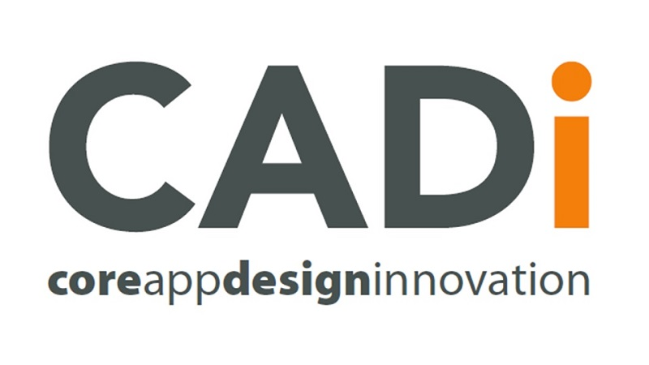

# Project Owner
*	Name: Bill Glennon.
*	Commenced: 4th March 2021.
*   Updated: 30th March 2021.
*	User: Glennobi
*	[Email: wglennon@outlook.ie](mailto:wglennon@outlook.ie)

## Developed for:

## and:

# Project Name

## “The CADi Website”
*   Check out my project, deployed on [GitHub Pages](https://glennobi.github.io/MS1-Project-Glennobi/index.html).
*	My MS1 Project - User Centric Frontend Development, to construct a static website for my own business, "CADi" (Core App Design Innovation).
*	Developed as part of the Code Institute Diploma in Software Development, started in December 2020.

# Project Description

## Who this website is for?
*	This website is being developed by Bill Glennon, for CADi.

## About CADi
*	CADi (Core App Design Innovation) is software development and a technical project management and delivery business.
*	It is run by a senior project and programme manager, who is also a qualified software developer, with vast experience in business and in the technical world.
*	CADi services include:
    *	Software project management and delivery
    *	Delivery of business transformation:
        *	The look & logo, New or updated websites, Mobile apps
    *	Major change & programme management
    *	Technical infrastructure project management and delivery
    *	Technical transformation and Operations management
    *	IT Service Delivery Management
*	Delivered to:
    *	Contract recruiters
    *	Large corporates
    *	Governmental institutions
    *	The SME sector
    *	Charities
    *	Community Projects

# UX

## CADi User Stories:

*	I am an SME sector business user:
    *	As a small business owner, living in very uncertain and socially distant times, I want to leverage the internet, to continue to be able to service existing customers, and still grow my business to service a new online audience.
    *	I want an online shop window to display my services, the ability to transact online, and to avail of government support and funding to transition my business. I want a local company, that I trust and would understand my business, to develop this for me.
    *   I want a local trusted provider, that I can talk to directly when permitted.
    *   I want to be easily able to contact CADi straight from it's website.
    *   To do this I expect to find a local provider with
        *   a simple easy to use website, that's easy to navigate around
        *   can locate and has direct, quick contact capability.  
*	We are a Charity and/or Community Project users:
    *	We would like to develop and launch a new corporate look, a fresh modern website and a mobile app to aid, assist and support our members. The app and website should:
        *	Reach out all our members & their families, allow members and their family members to connect together & share their experiences 
        *	Provide assistance, track activities and events
        *	Be intuitive and easy to use , be easy on the eye, fun to look at and interact with
        *	Have a clear iconography and catchy name
        *	Run on all platforms, conform to GDPR
    *	We expect our providers own website to have the same characteristics!
    *   I want a local trusted provider, that I can talk to directly when permitted.
    *   I want to be able to contact CADi straight from it's website.    
    *	As a charity / community project, we cannot afford a large development company, and would like to find a local agile dependable company to develop and support our look, app and website, a company that we can meet easily, and understands our local needs, and can adapt to future change.
*	We are Contract Recruiters, looking for contract Project, Programme and Service Delivery Managers:
    *	As a contract recruiter, I want to be able to quickly find the right project managers and get a very clear picture of who they are and what they can do. I want evidence that they can fill the roles I need to fill for my clients.
    *	I want to be able to find and contact a resource easily and quickly, as suitable roles arise.
    *   I want to be able to contact a contractor via email, and find out more information if I need it.
    *   I want to know where they are located.
*	I work in HR in a Large corporate, I'm looking for a contract project, programme and service managers:
    *	As a senior manager in a large corporate, I want to be able to clearly see potential project managers, amongst applications, their skills and experience, and suitability to the role, without having to trawl the internet and agencies.
    *	I want to be able to reference, remember and hire a flexible resource to meet my immediate need.
    *   I want to access the contractors LinkedIn profile.
    *   I want to see examples of their previous work.
*	I work for a Governmental institution, I'm looking for a project to be managed, delivered and closed:
    *	As a reviewer of tenders, I want to be able to clearly see an IT manager, their skills and experience, have them stand out, without having to trawl the internet and agencies.
    *	I want to be able to get a picture, additional information and hire an appropriate resource.
    *   I want to access the contractors LinkedIn profile.
    *   I want to see examples of their previous work.   

## Features for CADi Users

### Existing Features
*	Feature 1, Four clear, common Navigation Buttons
    *   as a user, this allows me to navigate easily and instinctively between each of the four pages, using buttons, common on each of the four pages of the website, without needing to use the browser refresh or “back” buttons. It’s browser independent, once you stay on the site.
*   Feature 2, Find Us, a Google Map link on home page
    *   as a small business, charity or community user, I can open CADI's location in Google Maps, and see CADi hq in a seperate tab. This is very reassuring that I CADi has a physical local presence.
*   Feature 3, Generate an email
    *   as a user, this link allows me to instantly create and open an email to CADi, for direct contact and a detailed non-standard enquiry.
*	Feature 4, External Links to Social
    *   as a corporate user, recruiter or governmantal agency, this feature allow me to link to the CADi owner’s LinkedIn profile, and to Skype. These open on a separate browser tab, to ensure my browser will “stick” with the CADi site, wherever I roam.
*   Feature 5, External links to CADi past work
    *   as a recruiter, I can quickly see CADi's experience and qualifications.
    *   as a small business user I can see examples of CADi's past work and style    
*	Feature 6, Enquiry form
    *   as a user I can fill the user enquiry form, with minimal typing to initiate a service enquiry quickly.

### Features Left to Implement
*	Enable Feature 6 – the Enquiry form, to allow real user enquiries to be easily and quickly submitted.
*	Develop fully active features - and enable 3 more dynamic functions on a new page
    *   develop blog, news and map location sections.
*	Tie in to a payment systems like Stripe or PayPal.
*   Tie into a quotation, invoicing and accounting system.

## Strategy
*	User Needs - What does CADi want for it’s visitors?
    *	When found on any device, interested parties: 
        *	are presented with a clear and descriptive range of services CADi supply to customers. What does CADi do?
        *	can understand clearly what it means to engage CADi, what value CADi will deliver. How does CADi do it?
        *	get a feeling of security and comfort that they are hiring a real and the right local service provider. What have CADi done?
        *	Facilitate business, wish to engage:
            *	Allow responsive and simple email and/or enquiries process to promptly get further information
            *	Allow easy contact and access to order a service in future.

*	Business Objectives - What does CADi want to achieve?
    *	Grow the business:
        *	Find, then drive new customers, new business and increased revenue to CADi.
    *	Be found:
        *	be found easily online, in any search for “project management and delivery services”, “design services” or “software development” in Ireland, the Irish midlands particularly.
    *	Increase repeat and referred business:
        *	Create and socialise the CADi brand with a robust and memorable online presence
        *	Create a good, simple mobile “e-business card” and e-shop window for a complex service set.
        *	Be e-message and potentially e-commerce ready in future.

*	Developer Objectives:
    *	My Project Goals for the CADi delivery
    *	My goals are to develop and produce a website for CADi and it’s potential clients, that is:
        *	Easily found - using best HTML practice, incorporating good HTML structure, structure tags, and content for best SEO.
        *	Clean and clear in appearance - by using Bootstrap for clean familiar appearance to the user, also using common recognised Font Awesome iconography.
        *	Intuitive and pleasant to use – using nice consistent colours, good common and consistent page layouts, easy navigation and clear form structure for enquiries. 
        *	Original and memorable in look and feel – through the use of strong colours, and good logo, by over-riding Bootstrap styling with customised CSS where appropriate.
        *	Simple well-structured content clearly and simply showing CADi’s complex service set.
        *	Responsive and quick to use – with consistent navigation throughout the website.
    * By:
        *   having External Links that open in new tabs - keep the CADi website open.
        *   Being nice to use internal links that keep users away from the browsers refresh or back buttons.
        *   Being responsive from the smallest to the largest screens and devices
        *   being scalable in future scope and function, ready for JavaScript.

## Scope
*	Functional spec
    *	The functions available at this stage are to:
        *   give CADi a web online presence 
        *   display CADi’s overall services
        *   give the details behind 2 specific service sets, Web & App development and Project Management
        *   show CADi's contact details
        *   show CADi's location
        *   give easy live access through links to social media
        *   allow direct contact to CADi via email. 
    *   There is an enquiry form that users may fill and perform a dummy submit.
    *	This feature will not become functional until later in the course, when JavaScript has been covered.
*	Content requirement
    *	Content must be clear and concise, cover all CADi services, explained simply to the end user.
    *	This is a business website not a personal resume, so no detailed CVs or Resumes are necessary.

## Structure
*	Interaction design
    *	There are 4 buttons on all 4 page headings that will bring you around the website. The browser “back” or “refresh” button will not need to be used. This will keep users on our website, reducing the risk of clicking away.
    *	The "logo" also acts as a "home" button.
    *   There is a live email link allowing the user to email CADi diirectly
    *   There are two live social media links, that will open in new browser pages.
    *   In each of the detailed service pages there are 6 live links to other relevant sites, illustrating other work and past experience.
    *   There is a form, that will allow population only at the MS1 stage.
    *   There is one Google Maps link on the site for location of CADi
*	Information design
    *	Information is grouped into a 1 summary home page with 2 detailed pages on CADi’s key services, and a 4th easy to use enquiry form page.
    *	CADi’s services are defined in a HTML responsive table, on the 2 service pages, keeping with the “1/3 rule” for ease of viewing.
    *	Headings and Footers are common across all pages of the site, for consistency.

## Skeleton
*	Interface design
    *	The layout and presentation of this project is shown in the included Mockplus generated wireframes files, in the "wireframes" folder included in this development pack under files:
        *	MS1 Wireframe with Mockplus 1.pdf
        *	MS1 Wireframe with Mockplus 2.pdf
*	Navigation design
    *	Internal Navigation is clear, simple and well presented, easy to find and use, and standard across the entire site. Font Awesome familiar iconography is used.
    *	External Navigation uses Bootstrap gentle fading and re-colouring. There are external links to:
        *   LinkedIn
        *   Skype
        *   Email button
        *   A sample website completed by CADi
        *   A smaple Android app completed by CADi
        *   A sample Apple app completed by CADi
        *   A second link to LinkedIn
        *   A link to IBM Ireland's homepage, CADi qualifications and experience
        *   A link to the British Computer Society hompage, CADi qualifications
        *   A live form, submit and refresh button, to easily generate an enquiry to CADi 
*	Information design
    *	Key information is presented in 3 summary tables, keeping good development practice, and are clear and concise.
    *	The whole site and it’s information will be responsive to the multitude of devices and browsers, that it will be displayed on. The project will be developed using “Mobile First” methodology.

## Surface
*	Visual Design
    *	The colours used match the existing logo and theme of CADi, comprising of gentle oranges, contrasting on greys and whites.
    *	The typography must be original but memorable, modern and plain.
    *	Imagery used reflects former project
    *	The Bootstrap CSS frame work will be used, with custom CSS styling where needed for local colours and logo, or challenging responsiveness issues. 

# Technologies Used
I used the following technologies to design, document, construct, test, deliver and deploy this project: 
*	Wireframing and Design:	
    *	Wireframing, Mockplus, link [Mockplus.com](https://app.mockplus.com/)
    *	Colours and text, Microsoft Paint, Powerpoint, Word, Adobe Acrobat.
    *	Documentation assistance, Mountain Goat, [Mountain Goat Software](https://www.mountaingoatsoftware.com/agile/user-stories) 
*	Coding Languages: 
    *	[HTML 5](https://en.wikipedia.org/wiki/HTML5) 
    *	[CSS 3](https://en.wikipedia.org/wiki/CSS) 
    *	[Bootstrap 4.1](https://getbootstrap.com/) 
    *	[Font Awesome iconography](https://fontawesome.com/) 
*	Project build Frameworks and Deployment: 
    *	[Github](https://github.com/Glennobi/MS1-Project-Glennobi) 
    *	Gitpod, through Github above
    *	Gitpages, through Github above
*	Testing, Performance and Issues resolution:
    *	The [WC3 Markup Validator](https://validator.w3.org/) 
    *	The [WC3 CSS Validator](https://jigsaw.w3.org/css-validator/) 
    *	Google Chrome browser “Inspect” and “Developer tools”
    *	[Chrome Lighthouse for performance testing](https://developers.google.com/web/tools/lighthouse) 
*	Other tools, help and assistance: 
    *	Google
    *	HTML assistance [W3schools.com](https://www.w3schools.com/html/)
    *	CSS assistance [W3schools.com](https://www.w3schools.com/css/)
    *	Bootstrap assistance, [W3schools.com](https://www.w3schools.com/bootstrap4l/)   

# Testing

## User Story Testing

### Heading and Footer Testing
*   I developed the common header and footer sections, common across the 4 pages of website.
*   I tested the navigation elements between all 4 pages.
*   I tested all the navigation containers, their functionality and appearance.
*   I tested and tuned the layout and responsiveness with basic placeholder text.
*   When happy with layout, response and responsiveness, I applied the content, and tested it again for layout then responsiveness.
*   I applied and tested various colour combinations then my logo.
*   I experimented and tested various bootstrap and Font Awesome iconography
*   I appled the icongraphy, motions and reactions to the active header elements and tested functionality, appearence and responsiveness.
*   I applied same to the active footer elements (email and social links) and tested function and responsiveness.
*   When happy with the hearings, footers, navigation and active elements, I set about styling the 4 detailed pages.

### Section and Content Testing
*   I had wireframed the content layout, and wrote the content outside Git
*   I selected applied and tested the background section imagery for the 4 .
*   Page 1 (of 4) - content was straightforward enough, spent time testing various font colours, weights and background opacity.
    *   It tested well for content, and worked well and responsively with the background image.
*   Page 2 & 3 - I decided to use and populate tables for the detailed (Who, What & How).
*   Pages 2, 3 & 4 - I used Bootstrap and tailored CSS to ensure tables and forms were responsive
    *   While the tables and forms looked great on medium and large devices, it was challenging getting them to display responsively on the smallest devices, especially the Samsung Fold and iPhone 5.
    *   I recorderd the screesizes of all the most common devices
    *   I wrote a test CSS file to tweak and tune all responsive CSS, and applied and tested rulesa across 10 device types and in protrait and landscape until I got all tables and forms to work well across all screen sizes and layouts.
    *   Key development then testing lesson - START WITH THE SMALLEST DEVICES, and work up!
    *   Key testing lesson - use style_copy.css CSS file so you can REVERT back if you make a mess of the nearly working original!      

### External nav links across the project:
*	Tested that all links change aspect and colour to ORANGE when hovered over then selected.
*	I clicked all links to ensure they worked, and enure they opened in a New Tab

### Internal nav links:
*	Tested that all links change aspect and colour to a darker GREY when hovered over then selected.
*	I clicked all links to ensure they worked, and enure they opened the correct page. The logo also act as a navigation to the home page.

### Enquiry Form:
*	Went to the "Enquiry" page
*	Filled the empty form and verified that an error message about the required fields appears
*	I tried to submit the form with an invalid email address and verified that a relevant error message appears
*	I submitted the form with all inputs valid and verified that a "Code Institute" success message appears.
*   I tested and verified that the form "Reset" button does just that.

## Code Validation Testing
* I ran my 4 HTML files through the [W3C Markup Validator](https://validator.w3.org/)
    * I have NO ERRORS on my index.html file, [index.html - green banner](https://validator.w3.org/nu/?doc=https%3A%2F%2Fglennobi.github.io%2FMS1-Project-Glennobi%2Findex.html)
    * I have NO ERRORS on my webapp.html file, [webapp.html - green banner](https://validator.w3.org/nu/?doc=https%3A%2F%2Fglennobi.github.io%2FMS1-Project-Glennobi%2Fwebapp.html)
    * I have NO ERRORS on my project.html file, [project.html - green banner](https://validator.w3.org/nu/?doc=https%3A%2F%2Fglennobi.github.io%2FMS1-Project-Glennobi%2Fproject.html)
    * I have NO ERRORS on my enquiry.html file, [enquiry.html - green banner](https://validator.w3.org/nu/?doc=https%3A%2F%2Fglennobi.github.io%2FMS1-Project-Glennobi%2Fenquiry.html)
* I ran my CSS file thtough the [W3C CSS Validator](https://jigsaw.w3.org/css-validator/)
    * I have NO ERRORS on my style.css file, [style.css - green banner](https://jigsaw.w3.org/css-validator/validator?uri=https%3A%2F%2Fglennobi.github.io%2FMS1-Project-Glennobi%2Fassets%2Fcss%2Fstyle.css&profile=css3svg&usermedium=all&warning=1&vextwarning=&lang=en)
 
## Website Performance Testing
* I ran my 4 HTML files through the [Google PageSpeed to get Lighthouse scores](https://developers.google.com/speed/pagespeed/insights/)
    * [index.html score 99% desktop 88% mobile](https://developers.google.com/speed/pagespeed/insights/?url=https%3A%2F%2Fglennobi.github.io%2FMS1-Project-Glennobi%2Findex.html&tab=desktop)
    * [webapp.html score 99% desktop 87% mobile](https://developers.google.com/speed/pagespeed/insights/?url=https%3A%2F%2Fglennobi.github.io%2FMS1-Project-Glennobi%2Fwebapp.html&tab=desktop)
    * [project.html score 99% desktop 88% mobile](https://developers.google.com/speed/pagespeed/insights/?url=https%3A%2F%2Fglennobi.github.io%2FMS1-Project-Glennobi%2Fproject.html&tab=desktop)
    * [enquiry.html score 99% desktop 87% mobile](https://developers.google.com/speed/pagespeed/insights/?url=https%3A%2F%2Fglennobi.github.io%2FMS1-Project-Glennobi%2Fenquiry.html&tab=desktop)

## Browser Compatibility Testing
*   I developed the project in Google Chrome and tested it there, on Firefox, Internet Explorer and on Microsoft Edge.
*   It looked and worked well on all 4 browsers, noting the following:
    *   Firefox was by far the best in terms of speed and responsiveness. On Page 4 of my website, my Enquiry Form, the tick boxes turn my grey colour, when selected on my form, as I wanted it.
    *   On Microsoft Edge, again, on Page 4 of my website, my Enquiry Form, the tick boxes turn my grey colour, when selected on my form, as I wanted it.
    *   On Google Chrome, they turn Bootstrap blue, and I could not over-ride this with loads of custom CSS!
    *   On Internet Explorer, I lost all opaque grey backgrounds on my Sections on all pages, texts, tables and forms. On speaking to a colleague, this is not unusual, in fact most development companies do not support Internet Explorer anymore.  
    
## Responsiveness Testing 
*   I tested responsivness in both portrait and landscape modes on:
    *   Moto G4, Galaxy S5, Pixel 2, Pixel 2XL, iPhone 5, 6, 7, 8, X, iPad, iPad Pro, Surface Duo, Galaxy Fold, Galaxy Note III
    *   See "bugs" section below.

## Bugs.
*   Un-ordered lists within tables are extremely difficult to display and make responsive on small and medium devices.
*   After loads of attempts, I scrapped the Unordered Lists and replaced them with new responsive table rows instead.
*   A good help to develop and test responsitivity is to draw a table of all common devices, and record their screen size width and height, in portrait and landscape, IN SIZE ORDER.
*   It is easier to start small and design up, than the other way around.
*   Inserting background images can change specificity and ruin a good layout! I had some playing around with various CSS "background" properties to gat it working.
*   Researched and found @media solutions to override CSS rules. Found "!important" keyword extremely helpful, in re-enforcing design and layout changes!
*   I found the only way to develop and avoid a lot of bugs:
    *   develop the project in stages from your wireframe
    *   using tight semantic HTML, developing all the common areas of all the pages of the site, Header and Footer first
    *   style these areas for the smallest devices up
    *   then design & develop the individual and unique Sections last
    *   style these Sections for the smallest devices upwards(this was the most time-consuming part of the project, 90% of the time getting the last 10% right!)

## Other Problems.
*   I had a lot of problems with GitHub, GitPod and Github Pages.
*   Whilst the "cheat-sheet" helped, I believe all course material needs to be updated in relation to repositories, workspaces and deployment (from Cloud9 etc).

# Deployment

##	Deployed to the Cloud.
*   Check out my project! Rather than use screenshots, here is a direct link to my deployed my project on [GitHub Pages](https://glennobi.github.io/MS1-Project-Glennobi/index.html).
*   Procedure followed:
    *   Selected my Project on Github
    *   Selected "Settings" tab
    *   Scrolled down to "Github Pages"
    *   Selected the "Source" as "branch" and "master"
    *   Saved the project

##	Deployed locally to Desktop.
*   I downloaded the [GitHub Desktop Application](https://desktop.github.com/)
*   Procedure followed:
    *   Selected my Project on Github
    *   Selected "Code" button
    *   Select "Open with GitHub Desktop"
    *   Selected the "Source" as "branch" and "master"
    *   Saved the project

# Credits

## Code
*	Apart from the use of the recommended Code Institute boilerplates, and the use of Gitpod pre-emptive syntax, all this code and it's structure belongs to Bill Glennon.
*   Code structure and layout, naturally, were influenced by the sample projects on the course. 

## Content
*	The colour scheme and the CADi logo were developed and designed by Paul Harkin and I, at House Of Design. See [House Of Design](https://houseofdesign.ie/about/)
*	The content was developed solely by Bill Glennon of CADi.

## Media
*	Imagery / photos used in this site were kindly obtained from Paul Harkin, at House Of Design. See [House Of Design](https://houseofdesign.ie/about/) 

## Acknowledgements
*	I received inspiration for this project from my own desire to learn new skills, to further develop my small home industry business, delivering project management services, with the hope of adding something different – the capability of delivering full software solutions to my customers, after the completion of this course.
*	I would like to thank Precious Ijege, My Code Institute mentor, for all his help and guidance throughout this project. 
*	I would like to thank Paul Harkin of House Of Design for help selecting a good colour scheme and suggested imagery.